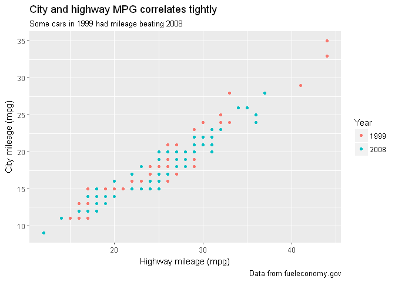
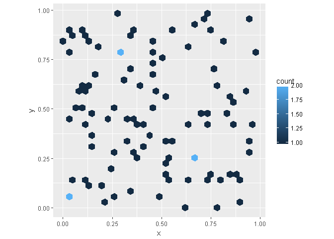
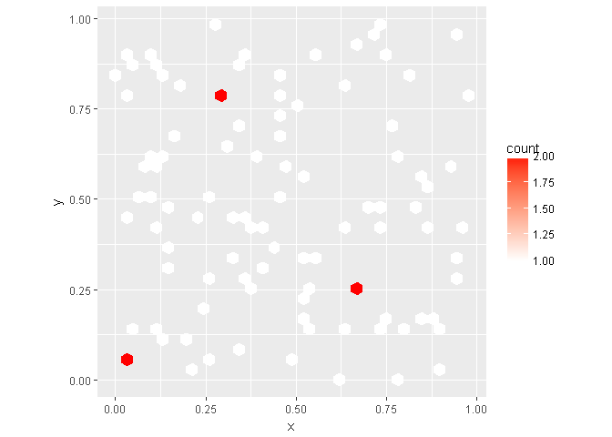

# r4ds_communicate_exercises_28
Jessica Maldonado  
November 5, 2017  


##28.2.1  
**1. Create one plot on the fuel economy data with customised title, subtitle, caption, x, y, and colour labels.**  


```r
ggplot(mpg, aes(hwy, cty)) +
  geom_point(aes(color = as.factor(year))) +
  labs(
    title = "City and highway MPG correlates tightly",
    subtitle = "Some cars in 1999 had mileage beating 2008",
    caption = "Data from fueleconomy.gov",
    x = "Highway mileage (mpg)",
    y = "City mileage (mpg)",
    color = "Year"
  )
```

<!-- -->

**2. The geom_smooth() is somewhat misleading because the hwy for large engines is skewed upwards due to the inclusion of lightweight sports cars with big engines. Use your modelling tools to fit and display a better model.** 

I had the geom_smooth use a subset of data tha t excluded class "2seater".  


```r
ggplot(mpg, aes(displ, hwy)) +
  geom_point(aes(color = class)) +
  geom_smooth(data = subset(mpg, class != "2seater"),se = FALSE) +
  labs(
    x = "Engine displacement (L)",
    y = "Highway fuel economy (mpg)",
    colour = "Car type"
  )
```

```
## `geom_smooth()` using method = 'loess'
```

<!-- -->

**3. Take an exploratory graphic that you've created in the last month, and add informative titles to make it easier for others to understand.**  


```r
gss_cat %>%
  mutate(partyid = fct_collapse(partyid, other = c("No answer", "Don't know", "Other party"),
    rep = c("Strong republican", "Not str republican"),
    ind = c("Ind,near rep", "Ind,near dem", "Independent"),
    dem = c("Not str democrat", "Strong democrat"))) %>%
    group_by(year) %>% 
    count(partyid) %>%
    mutate(prop = n / sum(n)) %>%
    ggplot(aes(year, prop)) +
    geom_col(aes(fill = partyid)) +
  labs(title = "Political party mix between 2000 and 2015",
       subtitle = "The party mix has not shifted much in this time",
       fill = "Political Party",
       x = "Year",
       y = "Proportion of population")
```

```
## Warning: package 'bindrcpp' was built under R version 3.4.2
```

<!-- -->

##28.3.1

**1. Use geom_text() with infinite positions to place text at the four corners of the plot.**  
I created 4 labels with combinations of positive and negative infinity to place labels on the edge of each corner.  

```r
label <- tibble(
  displ = Inf,
  hwy = Inf,
  label = "Test1")
label2<- tibble(
  displ = -Inf,
  hwy = Inf,
  label = "Test2")
label3 <- tibble(
  displ = Inf,
  hwy = -Inf,
  label = "Test3")
label4 <- tibble(
  displ = -Inf,
  hwy = -Inf,
  label = "Test4")

ggplot(mpg, aes(displ, hwy)) +
  geom_point() +
  geom_text(aes(label = label), data = label, vjust = "top", hjust = "right") +
  geom_text(aes(label = label), data = label2, vjust = "top", hjust = "left") +
  geom_text(aes(label = label), data = label3, vjust = "bottom", hjust = "right") +
  geom_text(aes(label = label), data = label4, vjust = "bottom", hjust= "left")
```

<!-- -->

**2. Read the documentation for annotate(). How can you use it to add a text label to a plot without having to create a tibble?**  

You can set the location of the text (i.e. x = 3, y = 7), tell annotate that you're using a text notation, and set the label equal to whatever you want. This is useful if you have a small number of notations and/or don't want to create a tibble.  

**3. How do labels with geom_text() interact with faceting? How can you add a label to a single facet? How can you put a different label in each facet? (Hint: think about the underlying data.)**  
By default, it will put the appropriate label in each facet.  

```r
max_hwy <- mpg %>%
  group_by(class) %>%
  filter(row_number(desc(hwy)) == 1)
  
ggplot(mpg, aes(displ, hwy)) +
  geom_point() +
  facet_wrap(~class) +
  geom_text(aes(label = model), data = max_hwy)
```

<!-- -->

To put a label in just one facet, I subsetted the max_hwy data to just compact cars, so there was only one label available.  

```r
ggplot(mpg, aes(displ, hwy)) +
  geom_point() +
  facet_wrap(~class) +
  geom_text(aes(label = model), data = subset(max_hwy, class == "compact"))
```

<!-- -->
  
To put a different text in each facet, you can pass a vector through that's the same length as the number of facets. I was only able to pass through a number or character vector. I wasn't able to have different variables of the max_hwy variable pull through for each in the same form.  

```r
ggplot(mpg, aes(displ, hwy)) +
  geom_point() +
  facet_wrap(~class) +
  geom_text(aes(label = c("class", "mpg", "cty", "model", "hwy", "cty", "hwy")), data = max_hwy)
```

<!-- -->

**4. What arguments to geom_label() control the appearance of the background box?**  

* label.padding changes the padding.  
* label.r changes the radius of corners.  
* label.size changes the size of the border.  

**5. What are the four arguments to arrow()? How do they work? Create a series of plots that demonstrate the most important options.**

* angle = the degree of the arrow head  
* length = length of arrow head  
* ends = where to draw the arrow head on the line  
* type = open or closed for the arrow head  

This chart with geom_segment is taking the minimum of hwy and displ and ending the line at the max of both. You can see it's a pretty small arrow, pointing to the (xend,yend) point, with a closed arrow head.  

```r
ggplot(mpg, aes(displ, hwy)) +
  geom_point()+
  geom_segment(aes(x = min(displ), y = min(hwy), xend = max(displ), yend = max(hwy)),
               arrow = arrow(angle = 15, length = unit(.15, "inches"), ends = "last", type = "closed"))
```

<!-- -->

By changing the angle and length of the arrow, you can see that it's a wider angle arrow, and also longer. By changing ends to "first", the direction points to (x,y) instead of (xend,yend). Changing type to "open" also produces an open arrow instead of a closed arrow.  

```r
ggplot(mpg, aes(displ, hwy)) +
  geom_point()+
  geom_segment(aes(x = min(displ), y = min(hwy), xend = max(displ), yend = max(hwy)),
               arrow = arrow(angle = 30, length = unit(.25, "inches"), ends = "first", type = "open"))
```

<!-- -->

##28.4.4

**1. Why doesn't the following code override the default scale?**  


```r
df <- data.frame(
  x = runif(100),
  y = runif(100),
  z1 = rnorm(100),
  z2 = abs(rnorm(100)))

ggplot(df, aes(x, y)) +
  geom_hex() +
  scale_colour_gradient(low = "white", high = "red") +
  coord_fixed()
```

<!-- -->

You have to use "fill" instead of "color" for the scale gradient, because fill is actually what's creating the gradient.  


```r
ggplot(df, aes(x, y)) +
  geom_hex() +
  scale_fill_gradient(low = "white", high = "red") +
  coord_fixed()
```

<!-- -->

**2. What is the first argument to every scale? How does it compare to labs()?**  
I would argue that there's not one argument to every scale because all of the scales have individual names to determine what they're maniuplating. Color and axis scales can have totally different arguments.  

As far as comparing to `labs()`, each of the scales are specified to which part of the plot they're changing. To change the x axis and y axis titles using scales, you would have `scale_x_continuous()` and `scale_y_continuous()` while within `labs()` you can set them as arguments of `x` and `y`.

**3. Change the display of the presidential terms by:**

1. Combining the two variants shown above.  

```r
presidential %>%
  mutate(id = 33 + row_number()) %>%
  ggplot(aes(start, id, color = party)) +
  geom_point() +
  geom_segment(aes(xend = end, yend = id)) +
  scale_color_manual(values = c(Republican = "red", Democratic = "blue")) +
  scale_x_date(NULL, breaks = presidential$start, date_labels = "'%y")
```

<!-- -->
  
1. Improving the display of the y axis.  

```r
presidential %>%
  mutate(id = 33 + row_number()) %>%
  ggplot(aes(start, id, color = party)) +
  geom_point() +
  geom_segment(aes(xend = end, yend = id)) +
  scale_color_manual(values = c(Republican = "red", Democratic = "blue")) +
  scale_x_date(NULL, breaks = presidential$start, date_labels = "'%y") +
  scale_y_continuous("Nth President", breaks = c(33:45)) 
```

<!-- -->
  
1. Labelling each term with the name of the president.  

```r
presidential %>%
  mutate(id = 33 + row_number()) %>%
  ggplot(aes(start, id, color = party)) +
  geom_point() +
  geom_segment(aes(xend = end, yend = id)) +
  geom_text(aes(label = name), nudge_y = .5, nudge_x = 1800) +
  scale_color_manual(values = c(Republican = "red", Democratic = "blue")) +
  scale_x_date(NULL, breaks = presidential$start, date_labels = "'%y") +
  scale_y_continuous("Nth President", breaks = c(33:45))
```

<!-- -->
1. Adding informative plot labels.  

```r
presidential %>%
  mutate(id = 33 + row_number()) %>%
  ggplot(aes(start, id, color = party)) +
  geom_point() +
  geom_segment(aes(xend = end, yend = id)) +
  geom_text(aes(label = name), nudge_y = .5, nudge_x = 1800) +
  annotate("text", x = max(presidential$start) - 1500, y = 37, label = "The first Bush was \nGeorge HW Bush Sr. \nThe second Bush \n was George W Bush.") +
  scale_color_manual(values = c(Republican = "red", Democratic = "blue")) +
  scale_x_date(NULL, breaks = presidential$start, date_labels = "'%y") +
  scale_y_continuous("Nth President", breaks = c(33:45)) 
```

<!-- -->
  
1. Placing breaks every 4 years (this is trickier than it seems!).

```r
presidential %>%
  mutate(id = 33 + row_number()) %>%
  ggplot(aes(start, id, color = party)) +
  geom_point() +
  geom_segment(aes(xend = end, yend = id)) +
  geom_text(aes(label = name), nudge_y = .5, nudge_x = 1800) +
  scale_color_manual(values = c(Republican = "red", Democratic = "blue")) +
  scale_x_date(NULL, date_breaks = "4 years", date_labels = "'%y") +
  scale_y_continuous("Nth President", breaks = c(33:45))  
```

<!-- -->
  
**4. Use override.aes to make the legend on the following plot easier to see.**


```r
ggplot(diamonds, aes(carat, price)) +
  geom_point(aes(colour = cut), alpha = 1/20)
```

<!-- -->


```r
ggplot(diamonds, aes(carat, price)) +
  geom_point(aes(colour = cut), alpha = 1/20) +
  guides(color = guide_legend(override.aes = list(alpha = 1)))
```

<!-- -->
